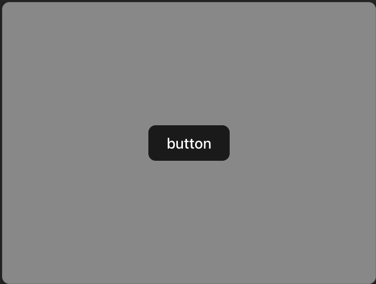

# Buttonコンポーネントを作る
このステップではButtonコンポーネントを作ります
Buttonコンポーネントはどのプロジェクトでも用いられる基本的なコンポーネントです


## Buttonをクリックできるようにする
まずはボタンをクリックできるようにしましょう
現状ボタンはそもそもクリックできないので、クリックできるようにするためにはどうすればいいでしょうか？
`src/components/Button.tsx`を以下のように編集してください

```diff ts
export const Button = () => {
-   return <p>button</p>;
+   return <button>button</button>;
};
```

次のようになればOKです


## Buttonのスタイルを変更する
次にボタンのスタイルを変更しましょう
`src/components/Button.module.css`を以下のように作成してください

```css
.button {
  border-radius: 8px;
  border: 1px solid transparent;
  padding: 0.6em 1.2em;
  font-size: 1em;
  font-weight: 500;
  font-family: inherit;
  background-color: #1a1a1a;
  cursor: pointer;
}
```

それぞれのプロパティの意味は以下の通りです
```
border-radius : 角丸
border : 枠線
padding : 内側の余白
font-size : 文字の大きさ
font-weight : 文字の太さ
font-family : 文字の種類
background-color : 背景色
cursor : マウスを乗せた時のカーソルの形
```

次に`src/components/Button.tsx`を以下のように編集してください

```diff ts
+ import styles from "./Button.module.css";

export const Button = () => {
  return <button className={styles.button}>button</button>;
};
```

次のようになればOKです



## Buttonのテキストを変更できるようにする
次にボタンのテキストを変更できるようにしましょう
`src/components/Button.tsx`を以下のように編集してください

```diff ts
+ import { ReactNode } from "react";
import styles from "./Button.module.css";
- export const Button = () => {
+ export const Button = (props: { children: ReactNode }) => {
- return <button>button</button>;
+ return <button className={styles.button}>{props.children}</button>;
};
```

? childrenとは？
: ReactNode型のプロパティで、コンポーネントの子要素を指します

? ReactNodeとは？
: Reactで使われる全ての要素の`型`です

? 子要素とは？
: コンポーネントの中に含まれる要素のことです
例: `<Button>ここが子要素</Button>`


また `src/App.tsx`を以下のように編集してください

```diff ts
import "./App.css";
import { Button } from "./components/Button";

function App() {
  return (
    <>
-      <Button />
+      <Button>ボタンだよ</Button>
    </>
  );
}

export default App;
```

次のようになればOKです


## 他のプロパティを受け付ける
最後にボタンに他のプロパティを受け付けるようにしましょう
本来buttonには色々なプロパティがあります
例えば、`type`や`onClick`などです

? typeとは？
: ボタンの種類を指します
例: `submit`や`reset`など

? onClickとは？
: ボタンがクリックされた時に実行される関数を指します

`src/components/Button.tsx`を以下のように編集してください

```diff ts
import { ReactNode } from "react";
import styles from "./Button.module.css";

export const Button = (props: {
  children: ReactNode;
+ type?: "button" | "submit" | "reset";
+ onClick?: () => void;
}) => {
  return (
    <button
      className={styles.button}
+     type={props.type}
+     onClick={props.onClick}
    >
      {props.children}
    </button>
  );
};
```

また `src/App.tsx`を以下のように編集してください

```diff ts
export default App;
import "./App.css";
import { Button } from "./components/Button";

function App() {
  return (
    <>
-     <Button>ボタンだよ</Button>
+     <Button onClick={() => alert("ボタンが押されました")}>ボタンだよ</Button>

    </>
  );
}

export default App;
```
? alertとは？
: ブラウザでポップアップを表示する関数です

ボタンを押した時に次のようになればOKです


[次のステップに進む](https://github.com/tosaken1116/penguin-hack-ui-tutoreal/blob/main/docs/3.md)