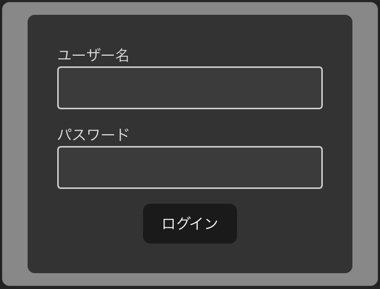

# ログインフォームを作る
このチュートリアルではログインフォームを作ります。

ログインフォームというのはサービスに関係するコンポーネントであるため`model`コンポーネントです

## inputコンポーネントを作る
まずはログインフォームの中にあるinputコンポーネントを作ります。

`src/components/Input.module.css`を以下のように作成してください
```css

.container {
  display: flex;
  flex-direction: column;
  align-items: start;
  width: 200px;
}

.input {
  width: 100%;
  padding: 8px;
  border: 2px solid #ccc;
  border-radius: 4px;
}

```

`src/components/Input.tsx`を以下のように作成してください
```tsx
import { ChangeEvent } from "react";
import styles from "./Input.module.css";
export const Input = (props: {
  value?: string;
  label?: string;
  type?: "text" | "password";
  onChange?: (event: ChangeEvent<HTMLInputElement>) => void;
}) => {
  return (
    <div className={styles.container}>
      <label>{props.label}</label>
      <input
        type={props.type || "text"}
        value={props.value}
        onChange={props.onChange}
        className={styles.input}
      />
    </div>
  );
};

```

? ChangeEventとは？
: inputの値が変更された時に発生するイベントの型です

次に`src/App.tsx`を以下のように編集してください

```diff
import "./App.css";
import { Button } from "./components/Button";
import { Input } from "./components/Input";

function App() {
  return (
    <>
+     <Input />
      <Button onClick={() => alert("ボタンが押されました")}>ボタンだよ</Button>
    </>
  );
}

export default App;

```

次のように表示されればOkです


文字列が入力されることも確認してください


## ログインフォームを作る
次にログインフォームを作ります

`src/components/LoginForm.module.css`を以下のように作成してください
```css
.container {
  padding: 32px;
  display: flex;
  justify-content: center;
  align-items: center;
  flex-direction: column;
  border-radius: 8px;
  background-color: #333333;
  gap:16px;
}
```

`src/components/LoginForm.tsx`を以下のように作成してください
```tsx
import { Input } from "./Input";
import { Button } from "./Button";
import styles from "./LoginForm.module.css";

export const LoginForm = () => {
  return (
    <form className={styles.container}>
      <Input label="ユーザー名" />
      <Input label="パスワード" type="password" />
      <Button type="submit">ログイン</Button>
    </form>
  );
};

```

次に`src/App.tsx`を以下のように編集してください

```diff
import "./App.css";
-import { Button } from "./components/Button";
-import { Input } from "./components/Input";
+import { LoginForm } from "./components/LoginForm";

function App() {
  return (
    <>
-     <Input />
-     <Button onClick={() => alert("ボタンが押されました")}>ボタンだよ</Button>
+    <LoginForm />
    </>
  );
}

export default App;

```

次のように表示されればOkです




[次のステップに進む](https://github.com/tosaken1116/ui-tutorial/blob/main/docs/4.md)
