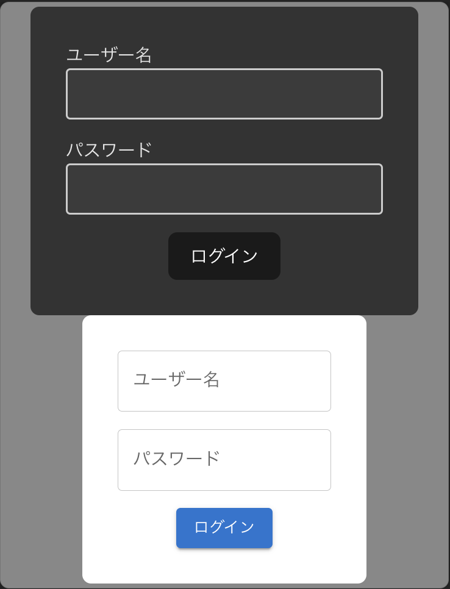
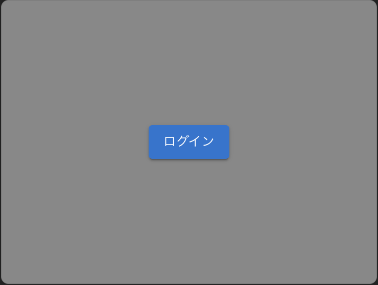
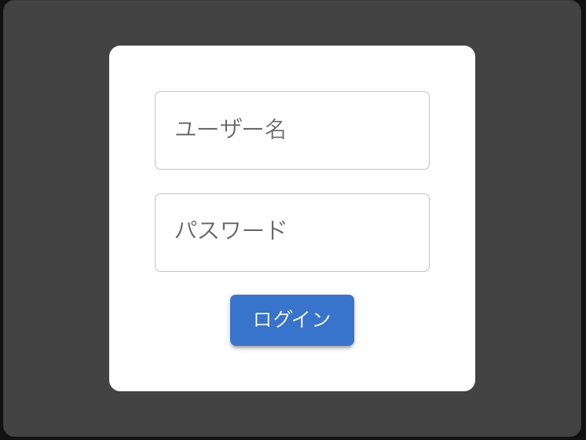

# ライブラリを利用する
このステップでは、UIライブラリを利用して、アプリケーションの見た目を整えます。

## UIライブラリの導入
UIライブラリとして、[Material-UI](https://material-ui.com/)を利用します。Material-UIは、Googleが提供するマテリアルデザインのコンポーネントを提供するライブラリです。

まずは、Material-UIをインストールしましょう。

```bash
npm install @mui/material @emotion/react @emotion/styled
```

## UIライブラリを使ってログインフォームを作る

次に、ログインフォームをMaterial-UIを使って作ります。

`src/components/MUILoginForm.tsx`を以下のように編集してください

```tsx
import { Button, FormControl, TextField } from "@mui/material";
export const MUILoginForm = () => {
  return (
    <FormControl
      sx={{
        padding: "32px",
        display: "flex",
        justifyContent: "center",
        alignItems: "center",
        flexDirection: "column",
        borderRadius: "8px",
        backgroundColor: "white",
        gap: "16px",
      }}
    >
      <TextField label="ユーザー名" className="" />
      <TextField label="パスワード" type="password" />
      <Button variant="contained" type="submit">
        ログイン
      </Button>
    </FormControl>
  );
};

```

次に`src/App.tsx`を以下のように編集してください

```tsx
import "./App.css";
import { LoginForm } from "./components/LoginForm";
+import { MUILoginForm } from "./components/MUILoginForm";

function App() {
  return (
    <>
      <LoginForm />
+     <MUILoginForm />
    </>
  );
}

export default App;
```

次のように表示されればOKです



いかがでしょうか
先ほど作成したInput,ButtonコンポーネントをMaterial-UIのコンポーネントに置き換えることができました

UIライブラリではこのように、既存のコンポーネントを利用することで、簡単に見た目を整えることができます

しかし、Material-UIのコンポーネントは、デフォルトでスタイルが適用されているため、カスタマイズが必要というデメリットもあります

UIライブラリにはMaterial-UI以外にも、[shadcn-ui](https://ui.shadcn.com/)や[Chakra UI](https://chakra-ui.com/)などがありますので、興味があれば調べてみてください

## ログインフォームをモーダルで表示する

最後に、ログインフォームをモーダルで表示するようにします
? モーダルとは？
: ユーザーに対して、何かしらの情報を入力してもらうために表示されるポップアップのことです

`src/components/ModalLoginForm.tsx`を以下のように作成してください

```tsx
import { Modal, Button } from "@mui/material";
import { MUILoginForm } from "./MUILoginForm";
import { useState } from "react";

export const ModalLoginForm = () => {
  const [open, setOpen] = useState(false);
  const handleOpen = () => setOpen(true);
  const handleClose = () => setOpen(false);
  return (
    <>
      <Button onClick={handleOpen} variant="contained">
        ログイン
      </Button>
      <Modal
        open={open}
        onClose={handleClose}
        sx={{
          display: "flex",
          justifyContent: "center",
          alignItems: "center",
        }}
      >
        <MUILoginForm />
      </Modal>
    </>
  );
};

```

次に`src/App.tsx`を以下のように編集してください

```tsx
import "./App.css";
- import { LoginForm } from "./components/LoginForm";
- import { MUILoginForm } from "./components/MUILoginForm";
+ import { ModalLoginForm } from "./components/ModalLoginForm";

function App() {
  return (
    <>
-     <LoginForm />
-     <MUILoginForm />
+     <ModalLoginForm />
    </>
  );
}

export default App;
```

次のように表示されればOKです



ログインボタンを押すと↓



モーダルが表示されます

これで、ログインフォームをモーダルで表示することができました

[次のステップに進む](https://github.com/tosaken1116/ui-tutorial/blob/main/docs/5.md)
