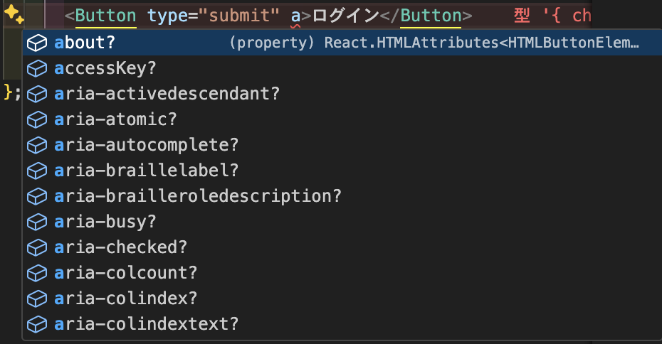
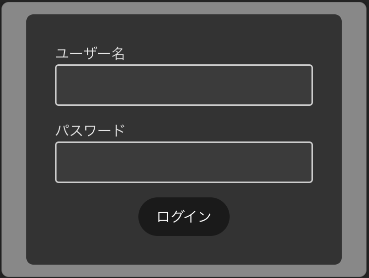
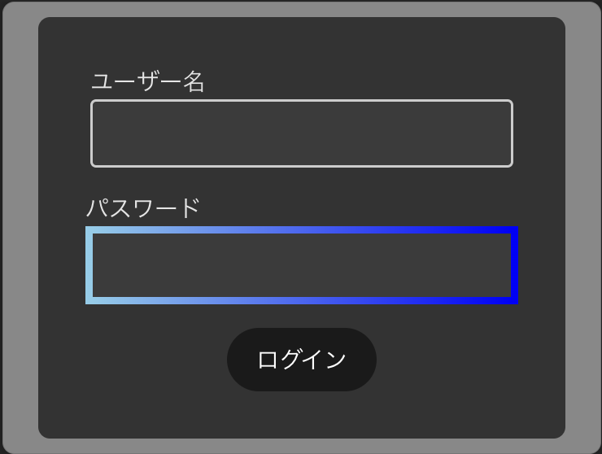

# UIコンポーネントを拡張する
このステップではUIコンポーネントをもっと使いやすくするために、UIコンポーネントを拡張します。

## Buttonコンポーネントの拡張

まずは、Buttonコンポーネントを拡張してみましょう。

現在Buttonコンポーネントでは`children` `type` `onClick`のみを受け取っています。

しかし、Buttonコンポーネントには他にも色々なプロパティがあります。
例:
- `disabled`
- `className`
- `style`
など

これらのプロパティを受け取れるようにしましょう。

`src/components/Button.tsx`を以下のように編集してください

```diff
- import { ReactNode } from "react";
+ import { ButtonHTMLAttributes } from "react";
import styles from "./Button.module.css";

-export const Button = (props: {
-  children: ReactNode;
-  type?: "button" | "submit" | "reset";
-  onClick?: () => void;
-}) => {
+export const Button = (props: ButtonHTMLAttributes<HTMLButtonElement>) => {

  return (
-   <button className={styles.button} type={props.type} onClick={props.onClick}>
+   <button className={styles.button} {...props}>
      {props.children}
    </button>
  );
};

```

? ButtonHTMLAttributes
: Button要素のプロパティを指定するための型です
ここでは`HTMLButtonElement`を指定しています

`src/components/LoginForm.tsx`を見てみるとこのように渡せるプロパティが増えていることが確認できます



これで、Buttonコンポーネントを使う際に、より多くのプロパティを指定できるようになりました

## classNameの衝突を解決する

次に、Buttonコンポーネントを使う際に、`className`が衝突しないようにしましょう
現状では、Buttonコンポーネントに`className`を指定すると、`Button.module.css`で指定したスタイルが上書きされてしまいます

これを解決するライブラリとして、`clsx`というライブラリがあります

? clsxとは？
: 複数のクラス名を結合するためのライブラリです

`clsx`を使って、`Button`コンポーネントに`className`を指定した際に、`Button.module.css`で指定したスタイルが上書きされないようにしましょう

まずは、`clsx`をインストールします

```bash
npm install clsx
```

次に、`src/components/Button.tsx`を以下のように編集してください

```diff
import { ButtonHTMLAttributes } from "react";
import styles from "./Button.module.css";
+import clsx from "clsx";

- export const Button = (props: ButtonHTMLAttributes<HTMLButtonElement>) => {
+ export const Button = ({className,...props}: ButtonHTMLAttributes<HTMLButtonElement>) => {
  return (
-   <button className={styles.button} {...props}>
+   <button className={clsx(styles.button, className)} {...props}>
      {props.children}
    </button>
  );
};

```

これで、`Button`コンポーネントに`className`を指定しても、`Button.module.css`で指定したスタイルが上書きされないようになりました

試しに`src/components/LoginForm.tsx`の`<Button>`に`className`を指定してみましょう
```diff
import { Input } from "./Input";
import { Button } from "./Button";
import styles from "./LoginForm.module.css";

export const LoginForm = () => {
  return (
    <form className={styles.container}>
      <Input label="ユーザー名" />
      <Input label="パスワード" type="password" />
-     <Button type="submit">ログイン</Button>
+     <Button type="submit" className={styles["login-button"]}>
+       ログイン
+     </Button>
    </form>
  );
};

```

`src/components/LoginForm.module.css`を以下のように編集してください

```diff
.container {
  padding: 32px;
  display: flex;
  justify-content: center;
  align-items: center;
  flex-direction: column;
  border-radius: 8px;
  background-color: #333333;
  gap:16px;
}

+ .login-button {
+   border-radius: 999px;
+ }
```

次に`src/App.tsx`を以下のように編集してください

```diff
import "./App.css";
+ import { LoginForm } from "./components/LoginForm";
- import { ModalLoginForm } from "./components/ModalLoginForm";

function App() {
  return (
    <>
-     <ModalLoginForm />
+     <LoginForm />
    </>
  );
}

export default App;
```

次のように表示されればOKです



ボタンの色を指定されており、かつ、角丸になっていることが確認できます
ボタンの色はButtonコンポーネントで定義されていて、角丸はLoginForm.module.cssで定義されています

これで、Buttonコンポーネントを使う際に、`className`が衝突しないようになりました

## Inputコンポーネントの拡張

これらと同様に、Inputコンポーネントも拡張してみましょう

`src/components/Input.tsx`を以下のように編集してください

```diff
- import { ChangeEvent, HTMLInputElement} from "react";
+ import { InputHTMLAttributes } from "react";
import styles from "./Input.module.css";
+ import clsx from "clsx";

- export const Input = (props: {
-  value?: string;
-  label?: string;
-  type?: "text" | "password";
-  onChange?: (event: ChangeEvent<HTMLInputElement>) => void;
- }) => {
+ export const Input = ({
+   className,
+   ...props
+ }: { label: string } & InputHTMLAttributes<HTMLInputElement>) => {
  return (
    <div className={styles.container}>
      <label>{props.label}</label>
-     <input
-       type={props.type || "text"}
-       value={props.value}
-       onChange={props.onChange}
-       className={styles.input}
-     />
+     <input className={clsx(styles.input, className)} {...props} />
    </div>
  );
};
```

`src/components/LoginForm.tsx`を以下のように編集してください

```diff
import { Input } from "./Input";
import { Button } from "./Button";
import styles from "./LoginForm.module.css";

export const LoginForm = () => {
  return (
    <form className={styles.container}>
      <Input label="ユーザー名" />
      <Input label="パスワード" type="password" className={styles["password-input"]/>
      <Button type="submit" className={styles["login-button"]}>
        ログイン
      </Button>
    </form>
  );
};

```

`src/components/LoginForm.module.css`を以下のように編集してください

```diff
.container {
  padding: 32px;
  display: flex;
  justify-content: center;
  align-items: center;
  flex-direction: column;
  border-radius: 8px;
  background-color: #333333;
  gap:16px;
}

.login-button{
  border-radius: 999px;
}

+.password-input{
+  border-width: 5px;
+  border-style: solid;
+  border-image-source: linear-gradient(90deg, skyblue, blue);
+  border-image-slice: 1;
+ }

```


次のように表示されればOKです



パスワードのInputコンポーネントに`className`を指定して、枠線が変わっていることが確認できます

ダサいですね


これで、UIコンポーネントをもっと使いやすくするために、UIコンポーネントを拡張することができました


[次のステップに進む](https://github.com/tosaken1116/ui-tutorial/blob/main/docs/6.md)
